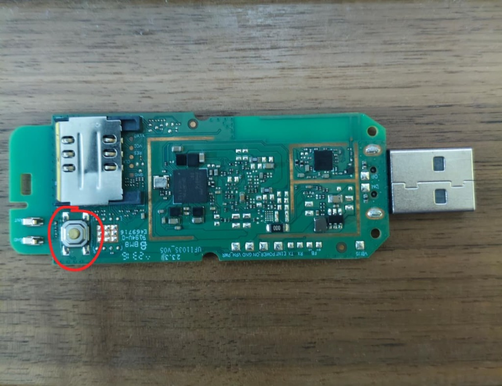

# OpenStick: Transform 4G USB Modem (Snapdragon 410 / MSM8916) into Linux Server

[](https://www.debian.org/)
[](https://github.com/msm8916-mainline)
[](LICENSE)
[](https://github.com/jimmylpx/openstick/releases/tag/v1)

Proyek ini bertujuan untuk mengubah dongle USB Modem 4G LTE berbasis prosesor **Qualcomm Snapdragon 410 (MSM8916)** (seperti board **HMUF02-V05**, **UZ801**, **UFI103S-V05**, dan varian sejenis) dari firmware Android bawaan pabrik menjadi **perangkat server Linux murni (Debian 12 Bookworm / Debian 13 Trixie 64-bit)** yang hemat daya, stabil, dan kaya fitur.

---

## 🌟 Pilihan Edisi Sistem Operasi

| Edisi OS | Ukuran Image | RAM Aktif | Penggunaan ROM | Fitur Utama |
| :--- | :--- | :--- | :--- | :--- |
| **Debian 12 (Bookworm)** | **~111 MB** | ~100 MB / 380 MB | ~351 MB / 3.4 GB | Stabil, Teruji, Ultra Ringan *(Rekomendasi)* |
| **Debian 13 (Trixie)** | **~121 MB** | ~110 MB / 380 MB | ~386 MB / 3.4 GB | Versi Terbaru, Glibc 2.41, Python 3.13, Native ADBD SDK 34 |

---

## 🌟 Fitur Utama & Kustomisasi

- **🚀 Universal One-Click Installer (`installer.sh`)**:
  - Pilihan interaktif untuk mem-flash **Debian 12 Bookworm** atau **Debian 13 Trixie**.
  - Otomatis membuat full backup firmware asli (`HM.bin`) via Qualcomm EDL 9008.
  - Mengekstrak partisi baseband & EFS asli (`fsc`, `fsg`, `modem`, `modemst1`, `modemst2`, `persist`, `sec`) secara dinamis langsung dari dump GPT.
  - Memulihkan seluruh partisi modem asli sehingga SIM card (Telkomsel, Indosat, XL, Tri, Smartfren) langsung aktif *out-of-the-box*.
- **🛡️ Pre-flight Dependency Check**: Memeriksa ketersediaan tool `adb`, `fastboot`, `edl`, `python3`, `unzip`, dan `wget` sebelum proses flashing dimulai.
- **❄️ Manajemen Termal Cerdas (Anti-Overheat & Anti-Restart)**:
  - **4G LTE Nonaktif Secara Default**: Menjaga perangkat tetap dingin saat awal booting.
  - **Dynamic Thermal Throttling**: Ketika 4G LTE diaktifkan, daemon termal otomatis mematikan Core 2 & 3 (*core offlining*) dan membatasi frekuensi Core 0 & 1 sehingga suhu tetap stabil di **~53°C – 57°C**.
  - Saat 4G LTE dimatikan, semua 4 Core CPU otomatis dipulihkan ke 1.0 GHz.
- **🔌 Pengatur Mode USB (Host OTG / Gadget / Auto-Detect)**:
  - **Gadget Mode**: Untuk dicolokkan ke PC/Laptop (Network RNDIS + ADB).
  - **Host Mode (OTG)**: Untuk membaca Flashdisk, USB Hub, USB Ethernet, atau Keyboard.
  - **Auto-Detect**: Menyesuaikan role saat dicolokkan ke PC Host.
- **📱 ADB Debugging Bawaan (Network & USB)**:
  - Default shell ADB masuk sebagai akun **`user`** demi keamanan. Jika membutuhkan hak akses root, jalankan `sudo su` atau `su -` (Password: `1`).
  - Akses shell ADB via jaringan: `adb connect 192.168.100.1:5555` -> `adb shell`.
  - Akses shell ADB native saat dicolokkan ke port USB.
- **🎛️ `sbrmenu` — TUI Network & Hardware Manager**:
  Menu interaktif berbasis TUI (`whiptail`) yang dapat dijalankan kapan saja dengan mengetik `sbrmenu`:
  1. **Buat Hotspot**: Konfigurasi SSID & Password WPA2 Personal, di-bridge ke `br0`.
  2. **Aktifkan Wi-Fi Client**: Terhubung ke Wi-Fi luar dengan proteksi *auto-fallback* ke hotspot darurat jika gagal.
  3. **Toggle 4G LTE**: Mengaktifkan/mematikan koneksi seluler & konfigurasi APN.
  4. **Papan Chat SMS Modem**: Membaca inbox/outbox per-kontak serta mengirim dan membalas SMS langsung dari modem.
  5. **Aktivasi DNSCrypt-Proxy**: Mengaktifkan Cloudflare DoH terenkripsi pada `127.0.0.1:5353`.
  6. **Installer Pi-hole**: Instalasi ad-blocker Pi-hole secara interaktif.
  7. **Atur Mode USB**: Beralih antara mode Host OTG, Gadget, atau set default boot permanen.

---

## 🛠️ Persyaratan Sistem & Alat

Pastikan komputer flasher (Linux / Raspberry Pi OS / Ubuntu / WSL2) telah menginstal dependensi:

### Debian / Ubuntu / Raspberry Pi OS:
```bash
sudo apt update
sudo apt install -y adb fastboot python3 python3-pip unzip wget
pip3 install edl   # Atau clone dari https://github.com/bkerler/edl
```

### Arch Linux:
```bash
sudo pacman -S android-tools python unzip wget
# Install edl via AUR: yay -S edl-git
```

---

## 📥 Panduan Instalasi (Step-by-Step)

### 1. Masuk ke Mode EDL 9008
Sebelum menjalankan script instalasi, perangkat harus dimasukkan ke mode **Qualcomm EDL (Emergency Download Mode 9008)**:



**Langkah-langkah:**
1. Cabut dongle USB modem dari komputer.
2. **Tekan dan tahan tombol kecil pada board** (lihat lingkaran merah pada gambar di atas).
3. Sambil tetap menahan tombol tersebut, **colokkan modem ke port USB komputer**.
4. **Tahan tombol selama ~5 detik** setelah dicolokkan, lalu lepaskan.
5. Periksa apakah perangkat sudah terdeteksi di mode EDL dengan perintah:
   ```bash
   lsusb
   ```
   Pastikan muncul ID: `05c6:9008 Qualcomm, Inc. Gobi Wireless Modem (QDL mode)`.

---

### 2. Unduh Paket Base Flasher
```bash
wget https://github.com/jimmylpx/openstick/releases/download/v1/hmuf02-v05.zip
unzip hmuf02-v05.zip
cd base
chmod +x installer.sh
```

### 3. Jalankan Installer Otomatis
```bash
./installer.sh
```
Pilih edisi OS yang diinginkan (Debian 12 Bookworm atau Debian 13 Trixie), dan script akan memproses seluruh tahapan (backup firmware asli, flash bootloader & OS, restore baseband modem) hingga selesai secara otomatis!

---

## 🖥️ Cara Mengakses Perangkat Setelah Instalasi

Setelah instalasi selesai dan modem selesai booting:

### 1. Akses via SSH (USB Ethernet / Wi-Fi)
- **IP Default**: `192.168.100.1`
- **Autentikasi**:
  - User Biasa: `user` (Password: `1`)
  - User Root: `root` (Password: `1`)
- **Perintah**:
  ```bash
  # Login sebagai user biasa
  ssh user@192.168.100.1

  # Atau login langsung sebagai root
  ssh root@192.168.100.1
  ```

### 2. Akses via ADB Shell (USB / Network)
- **Perintah**:
  ```bash
  # Sambungkan via IP (Port 5555)
  adb connect 192.168.100.1:5555

  # Buka Shell (Otomatis masuk sebagai user 'user')
  adb shell
  ```
- *Catatan*: Di dalam ADB shell, Anda dapat beralih ke root kapan saja dengan mengetik `sudo su` atau `su -` (Password: `1`).

### 3. Mengelola Jaringan & Fitur
Setelah login ke terminal modem, jalankan menu interaktif:
```bash
sbrmenu
```
