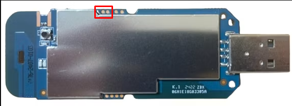

# OpenStick Snapdragon 410 (MSM8916) — Debian Linux Suite


OpenStick adalah project yang mengubah dongle modem 4G LTE berbasis **Qualcomm Snapdragon 410 (MSM8916)** menjadi komputer Linux kecil dengan konsumsi daya rendah.

Proyek ini ditujukan untuk board seperti **HMUF02-V05, UZ801, UFI103S-V05**, dan beberapa varian OpenStick lain yang menggunakan platform MSM8916.

Alih-alih menjalankan firmware Android bawaan, perangkat dapat menjalankan **Debian ARM64** dan digunakan untuk berbagai kebutuhan: server kecil, modem 4G, USB network adapter, Wi-Fi client, hotspot, DNS server, Pi-hole, dan masih banyak lagi.

> **Catatan:** Proses flashing menyentuh partisi internal perangkat. Pastikan Anda memahami langkah-langkahnya dan selalu simpan backup sebelum melakukan perubahan.

---

## Rilis yang tersedia

Saat ini tersedia tiga pilihan firmware:

| Firmware | Fitur Utama & RAM |
|---|---|
| **Debian 12 Bookworm (Standar)** | 4G Modem Aktif (RAM ~390MB) |
| **Debian 12 Bookworm (Modem-Disabled)** | Modem Nonaktif (RAM Sekitar ~466MB) |
| **Debian 13 Trixie** | 4G Modem Aktif (RAM ~390MB) |
| **Debian 13 Trixie (Modem-Disabled)** | Modem Nonaktif (RAM Sekitar ~466MB) |

**(Standar)** adalah pilihan jika Anda membutuhkan koneksi internet seluler melalui kartu SIM 4G LTE.

**(Modem-Disabled)** mengklaim kembali memori reserved modem (~85MB) sehingga kapasitas RAM bebas yang dapat digunakan sistem melonjak menjadi **sekitar 466MB** (dari total 512MB fisik, setelah dipotong alokasi TrustZone/hardware dasar). Sangat direkomendasikan untuk penggunaan homelab/server di mana koneksi internet diperoleh via Wi-Fi atau Ethernet USB.

---

## Apa yang bisa dilakukan OpenStick?

Beberapa fitur yang sudah tersedia di firmware ini:

- Instalasi Debian secara otomatis menggunakan `installer.sh`
- Backup eMMC dan partisi modem sebelum flashing
- Restore partisi modem asli setelah instalasi
- Dukungan modem 4G LTE
- USB RNDIS untuk koneksi jaringan melalui kabel USB
- Mode USB Gadget dan USB Host / OTG
- Wi-Fi Client
- Wi-Fi Hotspot
- SMS melalui modem
- DNSCrypt-Proxy dengan Cloudflare DoH
- Pi-hole
- Fastfetch
- Menu konfigurasi interaktif `sbrmenu`
- Pengaturan APN
- Manajemen termal CPU
- Akses SSH dan ADB

### `sbrmenu`

Sebagian besar fungsi jaringan dan hardware bisa diatur dari satu menu:

```bash
sbrmenu
```

Menu ini menggunakan `whiptail`, jadi Anda tidak perlu mengingat banyak perintah untuk melakukan konfigurasi dasar.

Dari sini Anda bisa:

1. Membuat hotspot Wi-Fi
2. Menghubungkan OpenStick ke Wi-Fi lain sebagai client
3. Mengaktifkan atau menonaktifkan 4G LTE
4. Mengatur APN
5. Membaca dan mengirim SMS
6. Mengaktifkan DNSCrypt-Proxy
7. Memasang Pi-hole
8. Mengubah mode USB
9. Mengatur mode USB default saat boot

---

## Mode USB

OpenStick dapat digunakan dalam dua mode utama.

### Gadget Mode

Ini adalah mode default.

Saat OpenStick dicolokkan ke komputer, komputer akan melihatnya sebagai perangkat jaringan USB menggunakan **RNDIS**.

Contohnya:

```text
OpenStick
    │
    └── USB
         │
         ▼
      Windows/Linux
         │
         └── USB Ethernet (RNDIS)
```

Mode ini cocok jika Anda ingin menggunakan OpenStick sebagai modem, router kecil, atau network device yang dikendalikan melalui USB.

### Host / OTG Mode

Dalam mode Host, OpenStick dapat digunakan untuk mengakses perangkat USB seperti:

- Flashdisk
- USB Hub
- USB Ethernet
- Keyboard
- Perangkat USB lainnya

---

## OpenStick sebagai USB Wi-Fi Adapter

Salah satu penggunaan yang menarik adalah menjadikan OpenStick sebagai USB Wi-Fi adapter.

Jika OpenStick terhubung ke jaringan Wi-Fi sebagai **Wi-Fi Client**, kemudian dicolokkan ke PC melalui USB, koneksi Wi-Fi tersebut dapat diteruskan ke PC melalui RNDIS.

Secara sederhana:

```text
Wi-Fi Router
     │
     │ Wi-Fi
     ▼
  OpenStick
     │
     │ USB / RNDIS
     ▼
 Windows / Linux PC
```

PC cukup melihat OpenStick sebagai koneksi Ethernet USB.

---

## DNSCrypt-Proxy

Firmware menyediakan opsi **DNSCrypt-Proxy** untuk mengenkripsi permintaan DNS menggunakan DNS over HTTPS.

Endpoint lokal yang digunakan:

```text
127.0.0.1:5353
```

Fitur ini dapat diaktifkan melalui:

```bash
sbrmenu
```

---

# Persyaratan

Anda membutuhkan komputer Linux untuk melakukan flashing.

Sistem yang dapat digunakan antara lain:

- Debian
- Ubuntu
- Raspberry Pi OS
- WSL2
- Distribusi Linux lain yang memiliki tool yang dibutuhkan

Pastikan perangkat tersebut memiliki:

- USB port
- akses `sudo`
- koneksi internet
- kabel USB yang mendukung data

---

## Install tools — Debian / Ubuntu / Raspberry Pi OS

```bash
sudo apt update
sudo apt install -y adb fastboot python3 python3-pip unzip wget
```

Kemudian install `edl`:

**[EDL_INSTALL.md](EDL_INSTALL.md)**

---

## Arch Linux

```bash
sudo pacman -S android-tools python unzip wget
```

Untuk `edl`:

```bash
yay -S edl-git
```

---

## Windows (10 / 11)

Di Windows, Anda dapat menginstal seluruh tool pendukung (**ADB, Fastboot, Python, dan Qualcomm EDL**) secara otomatis menggunakan satu skrip PowerShell:

```powershell
Set-ExecutionPolicy Bypass -Scope Process -Force; [System.Net.ServicePointManager]::SecurityProtocol = [System.Net.SecurityProtocolType]::Tls12; iex (irm https://raw.githubusercontent.com/jimmylpx/openstick/main/install_adb_fastboot_edl.ps1)
```

Panduan lengkap instalasi dan konfigurasi driver WinUSB Zadig:  
**[ADB_FASTBOOT_EDL_INSTALL_WINDOWS.md](ADB_FASTBOOT_EDL_INSTALL_WINDOWS.md)**

---

# Instalasi

Proses instalasi terdiri dari tiga bagian utama:

1. Masuk ke Qualcomm EDL 9008
2. Mengunduh paket flasher (`base-generic.zip`)
3. Menjalankan installer (tersedia versi Linux dan Windows)

Sebelum mulai, pastikan Anda sudah mengetahui tipe board OpenStick yang digunakan.

---

## 1. Masuk ke EDL 9008

OpenStick harus berada dalam mode:

```text
Qualcomm EDL / Emergency Download Mode
USB ID: 05c6:9008
```

Cara masuk ke EDL berbeda-beda tergantung board.

### HMUF02-V05 / UFI103S-V05

Board tertentu memiliki tombol EDL.

1. Cabut OpenStick dari komputer.
2. Tekan dan tahan tombol EDL pada board.
3. Sambil menahan tombol, colokkan OpenStick ke USB.
4. Tunggu sekitar 5 detik.
5. Lepaskan tombol.


---

## UZ801

UZ801 menyediakan dua cara untuk masuk ke EDL.

### Cara 1 — Software melalui ADB

Hubungkan PC ke OpenStick melalui Wi-Fi atau USB.

Buka:

```text
http://192.168.100.1/usbdebug.html
```

Tunggu sampai perangkat melakukan restart.

Kemudian jalankan:

```bash
adb wait-for-device
adb shell "setprop service.adb.root 1; busybox killall adbd"
adb wait-for-device
adb reboot edl
```

### Cara 2 — Hardware / Short Pin

1. Cabut OpenStick.
2. Hubungkan dua test point EDL menggunakan pinset atau jumper.
3. Sambil tetap menghubungkan kedua pin, colokkan OpenStick ke USB.
4. Tunggu sekitar 5 detik.
5. Lepaskan pinset/jumper.



> **Peringatan:** Short pin dilakukan langsung pada hardware. Pastikan Anda sudah mengetahui test point yang benar untuk board Anda. Jangan melakukan short pada pin yang salah.

---

## Cek apakah sudah masuk EDL

Di Linux, jalankan:

```bash
lsusb
```

Jika berhasil, Anda akan melihat perangkat Qualcomm dengan USB ID:

```text
05c6:9008 Qualcomm, Inc. Gobi Wireless Modem (QDL mode)
```

Di Windows, periksa di **Device Manager** pada bagian *Ports (COM & LPT)* atau *Universal Serial Bus devices* bahwa perangkat terdeteksi sebagai `Qualcomm HS-USB QDLoader 9008` atau `QHSUSB__BULK`.

Jika perangkat belum muncul sebagai mode EDL 9008, **jangan lanjut ke proses flashing**.

---

## 2. Download Base Flasher

Unduh paket flasher dasar `base-generic.zip` yang berisi partition table universal, bootloader komponen, dan skrip installer:

- **Download Link**: [base-generic.zip](https://github.com/jimmylpx/openstick/releases/download/v1/base-generic.zip)

Ekstrak berkas `base-generic.zip` tersebut ke folder pilihan Anda:

### Linux
```bash
wget https://github.com/jimmylpx/openstick/releases/download/v1/base-generic.zip
unzip base-generic.zip -d base
cd base
chmod +x installer.sh
```

### Windows
1. Unduh berkas [base-generic.zip](https://github.com/jimmylpx/openstick/releases/download/v1/base-generic.zip).
2. Klik kanan berkas zip $\rightarrow$ **Extract All...** ke sebuah folder (misalnya `base-generic`).
3. Buka folder hasil ekstraksi tersebut di File Explorer.

---

## 3. Jalankan Installer

Pilih instruksi yang sesuai dengan sistem operasi yang Anda gunakan:

### 🐧 Menggunakan Linux

Jalankan skrip installer:

```bash
./installer.sh
```

Untuk UZ801 yang masuk EDL menggunakan `adb reboot edl`, disarankan menjalankan installer dengan `sudo`:

```bash
sudo ./installer.sh
```

Installer akan memandu Anda memilih varian Debian yang ingin dipasang (Bookworm / Bookworm Modem-Disabled / Trixie / Trixie Modem-Disabled).

### 🪟 Menggunakan Windows

Di dalam folder hasil ekstraksi `base-generic`:

1. Pastikan perangkat OpenStick sudah terhubung dalam mode EDL 9008.
2. Klik dua kali pada berkas **`installer.bat`** (atau jalankan `python win_installer.py` melalui Terminal / CMD).
3. Jendela installer interaktif akan terbuka secara otomatis dan menampilkan menu pilihan varian sistem operasi Debian.
4. Masukkan nomor pilihan varian Anda (1, 2, 3, atau 4) lalu tekan **Enter**.
5. Installer akan mengunduh firmware Debian secara otomatis, membackup partisi asli, mem-flash sistem, dan mereboot perangkat langsung ke Linux.

---

## Apa yang dilakukan installer?

Installer dirancang untuk mengurangi jumlah langkah manual.

Secara umum prosesnya adalah:

### 1. Mendeteksi EDL

Installer memastikan OpenStick terdeteksi sebagai Qualcomm EDL 9008.

### 2. Backup eMMC

Installer membuat backup penuh:

```bash
edl rf backup.bin
```

Kemudian partisi modem penting diekstrak ke:

```text
extracted/
```

Termasuk:

```text
fsc
fsg
modem
modemst1
modemst2
persist
sec
```

Backup ini penting karena berisi data modem yang dibutuhkan agar fungsi seluler tetap berjalan dengan benar.

### 3. Masuk ke Fastboot

Installer menyiapkan bootloader dan melakukan reset sehingga perangkat dapat berpindah ke Fastboot tanpa harus melalui banyak langkah manual.

### 4. Flash Base Generic

Partition table dan komponen dasar dari paket `base/` akan ditulis ke perangkat.

### 5. Flash Debian

Installer mengunduh dan memasang firmware Debian yang dipilih:

- `bookworm.zip` (Debian 12 Bookworm Standar - 4G Modem Aktif)
- `bookworm-modem-disabled.zip` (Debian 12 Bookworm Modem-Disabled - RAM Sekitar ~466MB)
- `trixie.zip` (Debian 13 Trixie Standar - Testing)
- `trixie-modem-disabled.zip` (Debian 13 Trixie Modem-Disabled - RAM Sekitar ~466MB)

### 6. Restore partisi modem

Partisi modem dari hasil backup sebelumnya dikembalikan ke perangkat agar kalibrasi radio Wi-Fi (`persist`) dan integritas hardware (`sec`, `fsc`, dsb.) tetap terjaga.

### 7. Reboot

Setelah semuanya selesai, OpenStick akan reboot otomatis langsung ke Debian Linux.

---

# Setelah Instalasi

Boot pertama memerlukan waktu sekitar 30 - 40 detik.

Setelah Debian berhasil boot, Anda bisa mengakses OpenStick melalui USB, Wi-Fi, atau jaringan lokal.

---

# Akses dari Windows

Ada beberapa cara untuk mengakses OpenStick dari Windows.

## A. USB RNDIS + SSH

Colokkan OpenStick ke komputer.

Windows biasanya akan mendeteksi perangkat sebagai:

```text
Remote NDIS Compatible Device
```

Kemudian buka PowerShell atau CMD:

```bash
ssh user@192.168.100.1
```

Password default:

```text
1
```

---

## B. ADB

Jika ADB tersedia:

```bash
adb connect 192.168.100.1:5555
```

Kemudian:

```bash
adb shell
```

---

## C. Wi-Fi Hotspot

Hubungkan Windows ke hotspot OpenStick.

Default:

```text
SSID:     4G-UFI-XX
Password: 1234567890
```

Kemudian:

```bash
ssh user@192.168.100.1
```

Password:

```text
1
```

> Sebaiknya segera ganti password default setelah instalasi selesai.

---

# Akses dari Linux

## A. USB RNDIS

Colokkan OpenStick ke PC Linux.

Cari interface jaringan:

```bash
ip a
```

Nama interface bisa berbeda, misalnya:

```text
usb0
```

atau:

```text
enx...
```

Aktifkan interface:

```bash
sudo ip link set dev <nama_interface> up
```

Minta alamat IP melalui DHCP:

```bash
sudo dhclient <nama_interface>
```

Kemudian login:

```bash
ssh user@192.168.100.1
```

Password default:

```text
1
```

---

## B. ADB

```bash
adb connect 192.168.100.1:5555
adb shell
```

---

## C. Wi-Fi / LAN

Jika OpenStick terhubung ke jaringan Wi-Fi lokal, cari alamat IP-nya terlebih dahulu.

Setelah mengetahui IP:

```bash
ssh user@<IP_LOKAL_MODEM>
```

Contoh:

```bash
ssh user@192.168.1.50
```

---

# Akses Root

Login SSH sebagai `root` dinonaktifkan secara default.

Setelah masuk sebagai `user`, Anda bisa mendapatkan shell root dengan:

```bash
sudo su
```

Password default:

```text
1
```

Sekali lagi, sebaiknya ganti password setelah instalasi.

---

# Menggunakan `sbrmenu`

Setelah login:

```bash
sbrmenu
```

Anda akan mendapatkan menu untuk mengatur berbagai fitur OpenStick tanpa harus mengubah konfigurasi secara manual.

Beberapa opsi yang tersedia:

```text
Hotspot
Wi-Fi Client
4G LTE
SMS
DNSCrypt-Proxy
Pi-hole
USB Mode
```

Untuk pengguna baru, `sbrmenu` adalah cara termudah untuk mulai mengonfigurasi OpenStick.

---

# Build Firmware Sendiri

Kalau Anda ingin membuat firmware sendiri, source code dan build system tersedia di:

**[Build Your Own Firmware](https://github.com/jimmylpx/openstick/tree/main/sourcecode)**

Di sana tersedia:

- `build.sh`
- `packages.list`
- overlay filesystem
- konfigurasi firmware
- komponen untuk build Bookworm
- komponen untuk build Trixie

Ini cocok jika Anda ingin membuat image khusus dengan paket, service, konfigurasi jaringan, atau modifikasi sistem sendiri.

---

# Contoh Penggunaan

OpenStick cukup fleksibel dan bisa digunakan untuk berbagai proyek kecil.

### Server mini

```text
OpenStick
    │
    ├── Debian
    ├── SSH
    ├── Docker
    └── Service lainnya
```

### Router / modem 4G

```text
Internet 4G
     │
     ▼
 OpenStick
     │
     ├── Wi-Fi
     └── USB RNDIS
```

### DNS server

```text
Client
  │
  ▼
OpenStick
  │
  ├── Pi-hole
  └── DNSCrypt-Proxy
```

### USB network adapter

```text
Wi-Fi
  │
  ▼
OpenStick
  │ USB
  ▼
PC / Laptop
```

Karena ukurannya kecil dan konsumsi dayanya rendah, OpenStick juga cukup menarik untuk proyek yang membutuhkan komputer Linux yang bisa menyala 24/7.

---

# Troubleshooting

## OpenStick tidak terdeteksi sebagai EDL

Cek:

```bash
lsusb
```

Pastikan muncul:

```text
05c6:9008
```

Jika tidak muncul:

- pastikan kabel USB mendukung data
- coba port USB lain
- pastikan metode EDL sesuai dengan board
- ulangi proses masuk EDL

---

## `edl` mendapatkan Permission denied

Coba jalankan installer dengan:

```bash
sudo ./installer.sh
```

Terutama jika EDL dimasuki melalui:

```bash
adb reboot edl
```

---

## SSH tidak bisa terhubung

Pastikan OpenStick sudah selesai booting.

Untuk koneksi USB, periksa apakah interface RNDIS muncul:

```bash
ip a
```

Untuk Wi-Fi, pastikan PC berada pada jaringan yang sama dengan OpenStick.

---

## Tidak ada internet setelah Debian boot

Periksa interface:

```bash
ip a
```

Periksa routing:

```bash
ip route
```

Kemudian periksa DNS:

```bash
cat /etc/resolv.conf
```

Jika menggunakan Wi-Fi Client atau modem 4G, cek juga status koneksi melalui:

```bash
sbrmenu
```

---

# Credits

Proyek ini dibangun di atas kerja keras banyak proyek dan komunitas open-source.

Terima kasih kepada:

- **[HandsomeHacker / OpenStick Project](https://github.com/OpenStick)** — salah satu proyek awal yang membuka jalan bagi penggunaan Linux pada modem USB berbasis Qualcomm MSM8916.
- **[msm8916-mainline](https://github.com/msm8916-mainline)** — komunitas kernel Linux mainline untuk Snapdragon 410, termasuk pekerjaan kernel 6.12.x, device tree, BAM-DMUX, dan dukungan modem.
- **[LongQT-sea](https://github.com/LongQT-sea)** — referensi dan kontribusi terkait rootfs, kernel package, dan proses build firmware Debian.
- **[Bjoern Kerler / edl](https://github.com/bkerler/edl)** — tool Qualcomm Sahara / Firehose untuk backup dan flashing melalui EDL.
- **[DNSCrypt-Proxy](https://github.com/DNSCrypt/dnscrypt-proxy)** — DNS terenkripsi.
- **[Pi-hole](https://pi-hole.net/)** — network-wide DNS sinkhole dan ad blocking.
- **[Fastfetch](https://github.com/fastfetch-cli/fastfetch)** — informasi sistem yang ringan dan modern.

---

# Lisensi

Proyek ini dirilis di bawah:

**GNU General Public License v3.0 (GPLv3)**

---

## Catatan terakhir

OpenStick memang kecil, tetapi kemampuannya cukup jauh melampaui fungsi modem USB biasa.

Dengan Debian ARM64, perangkat ini bisa dijadikan modem 4G, USB network adapter, Wi-Fi client, hotspot, DNS server, server kecil, atau bahkan dasar untuk proyek Linux yang lebih besar.

Kalau Anda baru pertama kali menggunakan OpenStick, **mulailah dari Debian 12 Bookworm**, buat backup terlebih dahulu, lalu gunakan `sbrmenu` untuk mengatur perangkat setelah berhasil boot.

